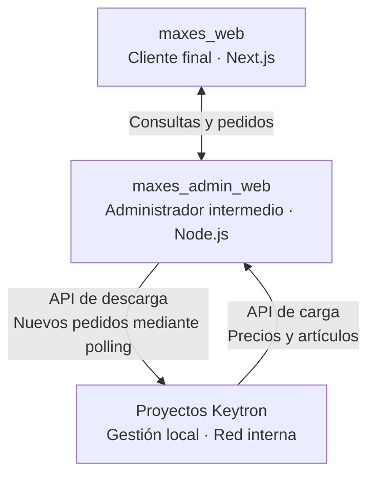
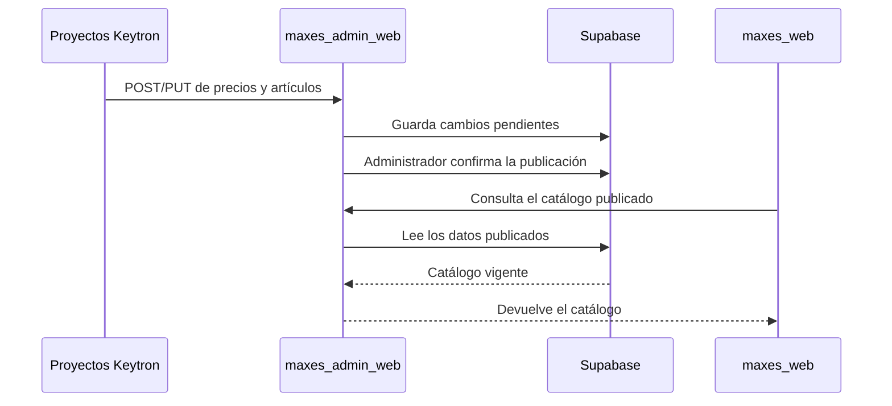
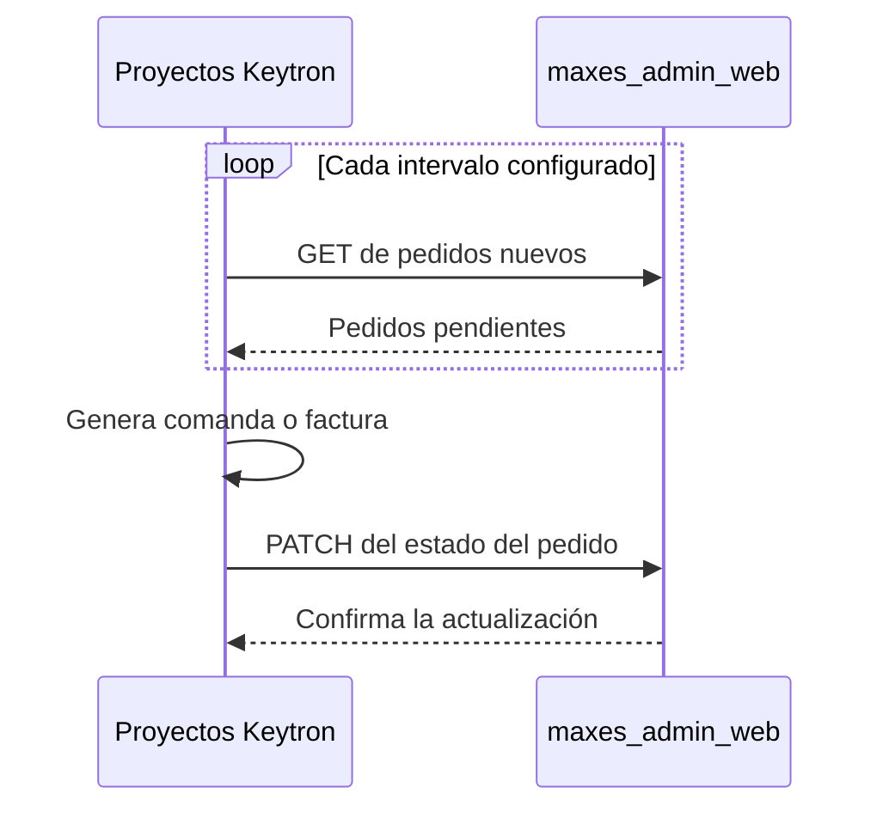

# Ecosistema Maxes

## Documentación de arquitectura del sistema

Este documento describe la arquitectura desacoplada en tres capas del ecosistema digital de Maxes. El diseño busca garantizar la seguridad de la gestión interna, una navegación rápida para el cliente final y un control explícito sobre la publicación de datos.

---

## Mapa general del ecosistema

## 1. `maxes_web`: página web pública

### Rol principal

Es la cara visible del negocio para el cliente final. Está optimizada para dispositivos móviles, velocidad de carga y posicionamiento en buscadores (SEO). Funciona como un catálogo interactivo que permite armar un carrito y realizar pedidos.

- **Persistencia sin inicio de sesión:** mantiene los favoritos y el carrito en el almacenamiento local del dispositivo.
- **Aislamiento de datos:** no se conecta directamente con los sistemas internos de la empresa ni con la base de datos productiva de Supabase. Toda comunicación pasa por la capa intermedia.

### Tecnologías

- **Framework:** Next.js, React y TypeScript.
- **Despliegue y hosting:** Vercel.
- **Estado global:** Zustand con persistencia en `localStorage`.
- **Estilos:** Tailwind CSS y componentes visuales reutilizables.

## 2. `maxes_admin_web`: administrador intermedio

### Rol principal

Funciona como zona de amortiguación y aduana de seguridad. Expone los endpoints que necesita la web y ofrece un panel privado para tomar decisiones operativas sobre su contenido.

- **Buffer de precios:** recibe actualizaciones de precios y artículos desde la gestión interna, pero no las publica hasta que un administrador confirma la acción mediante **Publicar cambios**.
- **Gestión del frontend:** permite cargar banners e imágenes del carrusel, además de ocultar o mostrar artículos específicos.
- **Seguridad activa:** utiliza Row Level Security (RLS) de Supabase para impedir accesos no autorizados por fuera del backend.

### Tecnologías

- **Backend:** Node.js con Express o rutas de API integradas en Next.js.
- **Base de datos cloud:** Supabase sobre PostgreSQL.
- **Almacenamiento de imágenes:** Supabase Storage.
- **ORM:** Prisma mediante el Connection Pooler de Supabase, en el puerto `6543`.

## 3. Proyectos Keytron: gestión interna

### Rol principal

Constituyen el núcleo administrativo de la empresa y se ejecutan exclusivamente dentro de la red local. Allí reside la lógica de negocio que no debe exponerse a internet.

- **Operaciones críticas:** control del stock físico, facturación, cuentas corrientes, reportes financieros, márgenes de ganancia y costos de compra.
- **Sincronización:** inician el envío de datos actualizados y consultan los nuevos pedidos pendientes de procesamiento.

## Conectividad y flujo de datos

La comunicación entre el entorno local —los proyectos Keytron— y la nube —`maxes_admin_web`— se realiza mediante dos canales independientes.

### 1. API de carga: precios y artículos

- **Dirección:** `Proyectos Keytron` → `maxes_admin_web`.
- **Flujo:** cuando cambian costos, precios o datos de artículos en la red local, el sistema interno envía una petición `POST` o `PUT` a la API del administrador intermedio.
- **Estado intermedio:** los datos se guardan en Supabase como pendientes de publicación. Permanecen disponibles en el panel de `maxes_admin_web` hasta que un administrador confirma su publicación en `maxes_web`.

### 2. API de descarga: pedidos

- **Dirección:** `maxes_admin_web` → `Proyectos Keytron`, mediante consultas iniciadas desde Keytron.
- **Flujo:** cada cierto intervalo, un proceso en segundo plano de Keytron realiza una petición `GET` al administrador intermedio para consultar pedidos nuevos.
- **Procesamiento:** cuando existen pedidos, Keytron los descarga, genera la comanda o factura y responde con una petición `PATCH` para cambiar su estado a **Descargado** o **En preparación**.
- **Seguridad:** el uso de *polling* evita abrir puertos en el router o configurar direcciones IP públicas para la red local.

## Principios de la arquitectura

1. **Aislamiento:** la web pública nunca accede directamente a la gestión interna.
2. **Publicación controlada:** las novedades del catálogo requieren aprobación antes de quedar visibles.
3. **Iniciativa desde la intranet:** Keytron inicia toda comunicación entre la red local y la nube.
4. **Responsabilidades separadas:** cada capa mantiene una función concreta y puede evolucionar de forma independiente.
5. **Mínima exposición:** la red interna no necesita aceptar conexiones entrantes desde internet.
